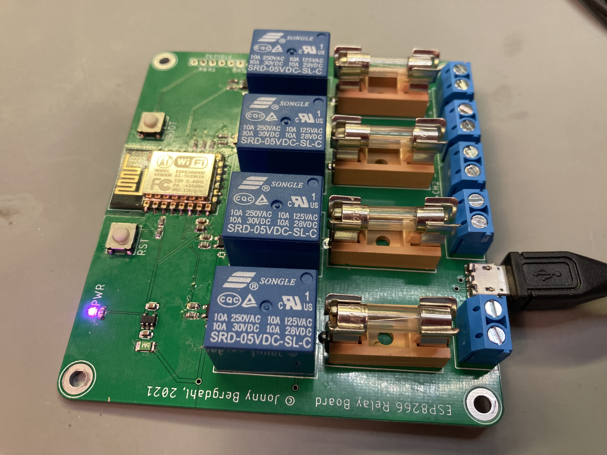

# ESP12_4RelayBoard

This is a simple ESP-12 based 4 relay board I designed to be used in Home Assistant. It is powered by 5V over a micro USB connector,
and switches loads at up to the rated voltage of the relay - 28V/10A, although I recommend limiting the power to max 6 Amps per channel.
Also, the screw connectors used are rated at maximum 15A, so you need to keep the _total combined_ power usage under that limit.

> NOTE: This PCB is _NOT_ designed to be used for mains voltage!



## PCB files

I have added the Gerber files in the `PCB/Gerber` folder, just zip and upload to your favorite PCB manufacturer.

I have also included the EAGLE design files if you need to modify the design for yoyr needs.

## Firmware

I use ESPHome to set it up, which is the easiest way for it to show up in Home Assistant. 

Change the `esphome` section to this:

```
esphome:
  name: relay1
  platform: ESP8266
  board: esp12e
```
Add the following section to add the relays as switches in Home Assistant.

```
switch:
  - platform: gpio
    name: "Relay1"
    pin: GPIO4
  - platform: gpio
    name: "Relay2"
    pin: GPIO5
  - platform: gpio
    name: "Relay3"
    pin: GPIO12
  - platform: gpio
    name: "Relay4"
    pin: GPIO13
```

### Flashing the board

You will need a USB-Serial adapter for initial upload of the firmware, and use the [ESPHome-Flasher](https://github.com/esphome/esphome-flasher) flashing utility.

 - Compile and download the firmware to your local machine.
 - Connect the serial adapter to the board, the board is designed for the pinout of standard FT232RL adapters.
 - Hold down the BOOT button, tap the RST button and then let go of RST. This puts the ESP-12 module in bootloader mode ready for firmware upload.
 - Start ESPHome-Flasher, select the firmware file and the proper COM port and click _Flash ESP_.

## Enclosure


I designed a simple enclosure for 3D printing, available as STL files in the `Enclosure` folder. 

I also included the Fusion360 design file if you need to modify the design for your usage. 
